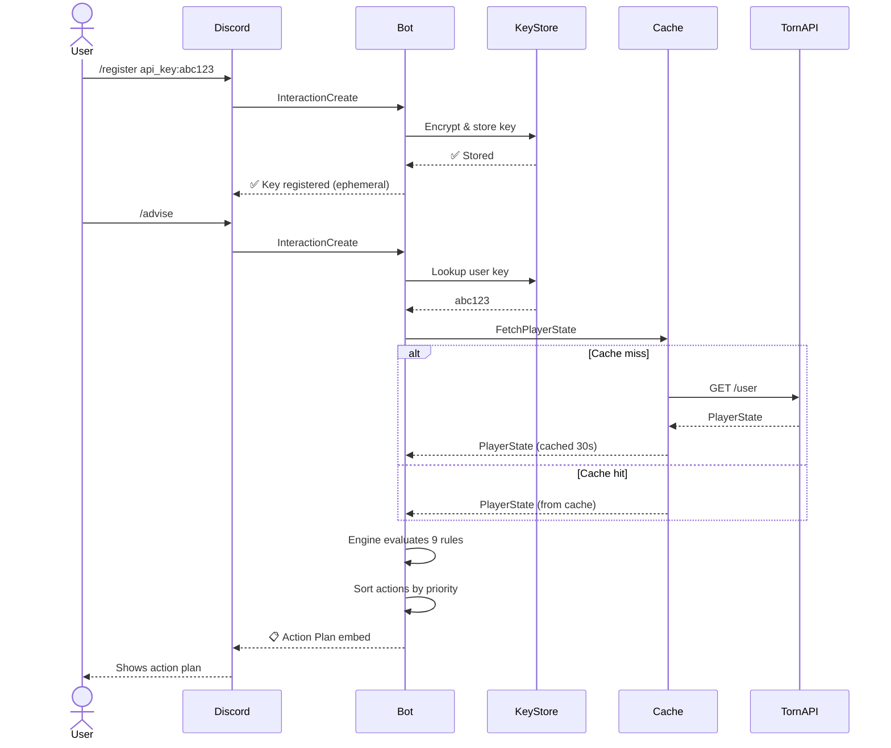

<div align="center">

<picture>
  <source media="(prefers-color-scheme: dark)" srcset="https://img.shields.io/badge/%F0%9F%A4%96_Torn_Advisor_Bot-Discord_Companion-7289DA?style=for-the-badge&labelColor=2C2F33">
  
</picture>

<br><br>

[](https://discord.com)
[](Dockerfile)
[](https://go.dev)
[](#-security)

<br>

**A full-featured Discord bot that connects the Torn Advisor engine directly to your server — giving every member personalized, real-time action plans via slash commands.**

<br>

[Quick Start](#-quick-start) · [Commands](#-slash-commands) · [Features](#-key-features) · [Deploy](#-deployment) · [Security](#-security) · [Webhook Mode](#-webhook-mode)

</div>

<br>

---

<div align="center">

## 💬 What It Looks Like

</div>

<br>

<table>
<tr>
<td width="50%">

### `/advise` — Action Plan

```
╭──────────────────────────────────────╮
│  🎯 Torn Advisor — Action Plan       │
│──────────────────────────────────────│
│                                      │
│  1. [hospital] Heal Up     (98)      │
│     Life is below 50% — heal         │
│     before taking any action.        │
│                                      │
│  2. [drug] Take Xanax      (90)     │
│     Xanax cooldown is ready —        │
│     take for an energy boost.        │
│                                      │
│  3. [gym] Train at Gym     (80)      │
│     Energy and happiness are         │
│     sufficient — train your stats.   │
│                                      │
╰──────────────────────────────────────╯
```

</td>
<td width="50%">

### `/status` — Player Stats

```
╭──────────────────────────────────────╮
│  📊 Player Status                    │
│──────────────────────────────────────│
│                                      │
│  ⚡ Energy     150 / 150             │
│  🔥 Nerve       25 / 25             │
│  😊 Happy          8,500            │
│  ❤️ Life      1,200 / 1,200         │
│  ⛓️ Chain      Active               │
│  ⚔️ War        Inactive             │
│                                      │
╰──────────────────────────────────────╯
```

</td>
</tr>
<tr>
<td>

### `/config` — Rule Priorities

```
╭──────────────────────────────────────╮
│  ⚙️ Rule Priorities                  │
│──────────────────────────────────────│
│                                      │
│  Hospital:  98    Rehab:    85       │
│  Chain:     97    Gym:      80       │
│  War:       95    Crime:    70       │
│  Xanax:     90    Travel:   60       │
│                   Booster:  55       │
│                                      │
╰──────────────────────────────────────╯
```

</td>
<td>

### `⏰ Scheduled Alert` — Urgent Actions

```
╭──────────────────────────────────────╮
│  ⏰ Scheduled Advice — Urgent        │
│──────────────────────────────────────│
│                                      │
│  1. [hospital] Heal Up     (98)      │
│     Life is below 50% — heal now!    │
│                                      │
│  2. [drug] Take Xanax      (90)     │
│     Cooldown ready — don't waste it. │
│                                      │
│  🔴 Only priority ≥ 90 shown        │
╰──────────────────────────────────────╯
```

</td>
</tr>
</table>

<br>

---

<div align="center">

## 🚀 Quick Start

**Get the bot running in your Discord server in under 5 minutes.**

</div>

<br>

### 1️⃣ Create a Discord Application

Head to the **[Discord Developer Portal](https://discord.com/developers/applications)** and create a new app.

| What You Need | Where to Find It |
|:--------------|:-----------------|
| 🔑 **Bot Token** | `Bot` → `Reset Token` → Copy |
| 🆔 **Application ID** | `General Information` → `Application ID` |

### 2️⃣ Invite the Bot to Your Server

Use this URL (replace `YOUR_APP_ID`):

```
https://discord.com/api/oauth2/authorize?client_id=YOUR_APP_ID&permissions=2048&scope=bot%20applications.commands
```

> Requests only **Send Messages** + **Slash Commands** scope — minimal and secure.

### 3️⃣ Generate an Encryption Key

<table>
<tr>
<td>

**Linux / macOS**
```bash
openssl rand -hex 32
```

</td>
<td>

**Windows (PowerShell)**
```powershell
-join ((1..32) | ForEach-Object {
  '{0:x2}' -f (Get-Random -Maximum 256)
})
```

</td>
</tr>
</table>

### 4️⃣ Configure & Launch

```bash
git clone https://github.com/subhanjanOps/torn-advisor.git
cd torn-advisor
```

Create a **`.env`** file:

```env
DISCORD_BOT_TOKEN=your-bot-token-here
DISCORD_APP_ID=your-application-id
ENCRYPTION_KEY=your-64-character-hex-key
```

Start with Docker Compose:

```bash
docker compose up -d --build
```

### 5️⃣ Use It!

In your Discord server, type:

```
/register api_key:YOUR_TORN_API_KEY
/advise
```

✅ **Done.** You'll see your personalized action plan.

<br>

---

<div align="center">

## 💬 Slash Commands

</div>

<br>

<table>
<tr>
<th colspan="3" align="center">

### 🔐 Account Management

</th>
</tr>
<tr>
<td width="25%"><b>Command</b></td>
<td width="35%"><b>Description</b></td>
<td width="40%"><b>Details</b></td>
</tr>
<tr>
<td><code>/register &lt;api_key&gt;</code></td>
<td>Store your Torn API key</td>
<td>Encrypted with AES-256-GCM. Response is <b>ephemeral</b> (only you see it).</td>
</tr>
<tr>
<td><code>/unregister</code></td>
<td>Delete your stored key</td>
<td>Removes the key from disk, clears cache, and cancels any active schedule.</td>
</tr>
</table>

<table>
<tr>
<th colspan="3" align="center">

### 📊 Intelligence

</th>
</tr>
<tr>
<td width="25%"><b>Command</b></td>
<td width="35%"><b>Description</b></td>
<td width="40%"><b>Details</b></td>
</tr>
<tr>
<td><code>/advise</code></td>
<td>Get your prioritized action plan</td>
<td>Evaluates all 9 rules against your live state. Shows actions sorted by priority.</td>
</tr>
<tr>
<td><code>/status</code></td>
<td>View current player stats</td>
<td>Energy, Nerve, Happy, Life, Chain, and War status at a glance.</td>
</tr>
<tr>
<td><code>/config</code></td>
<td>View rule priority weights</td>
<td>Shows the current priority value for all 9 rules.</td>
</tr>
</table>

<table>
<tr>
<th colspan="3" align="center">

### ⏰ Scheduled Alerts

</th>
</tr>
<tr>
<td width="25%"><b>Command</b></td>
<td width="35%"><b>Description</b></td>
<td width="40%"><b>Details</b></td>
</tr>
<tr>
<td><code>/schedule</code></td>
<td>Enable auto-alerts (every 15 min)</td>
<td>Posts to the current channel. Only fires when there are <b>urgent actions</b> (priority ≥ 90).</td>
</tr>
<tr>
<td><code>/unschedule</code></td>
<td>Disable periodic alerts</td>
<td>Stops the scheduler for your account. Does not remove your API key.</td>
</tr>
</table>

<br>

---

<div align="center">

## ✨ Key Features

</div>

<br>

<table>
<tr>
<td align="center" width="33%">

### 👥 Multi-User

Every Discord member registers their own Torn API key. The bot maintains per-user cached providers and delivers personalized advice.

</td>
<td align="center" width="33%">

### 🔐 Encrypted Storage

API keys are encrypted at rest with **AES-256-GCM** using a 32-byte secret. Keys live only in memory during runtime and in encrypted form on disk.

</td>
<td align="center" width="33%">

### ⚡ Response Caching

Torn API responses are cached with a **30-second TTL** to prevent rate limiting. Double-checked locking ensures thread safety under concurrent requests.

</td>
</tr>
<tr>
<td align="center">

### ⏰ Smart Scheduler

Every **15 minutes**, the bot checks registered users' states and posts **only urgent actions** (priority ≥ 90) to their opted-in channels. No spam.

</td>
<td align="center">

### 👻 Ephemeral Responses

Sensitive commands (`/register`, error messages) use Discord's ephemeral flag — **only the invoking user** can see them. Your API key is never exposed to the channel.

</td>
<td align="center">

### 🛑 Graceful Shutdown

The bot uses Go's `context.Context` propagation. On `SIGINT`/`SIGTERM`, it cancels all in-flight API calls, stops the scheduler, and cleanly closes the Discord session.

</td>
</tr>
</table>

<br>

---

<div align="center">

## ⚙️ How It Works

</div>

<br>



<br>

### Architecture Flow

```
  ┌─────────────┐     ┌─────────────┐     ┌─────────────┐
  │   Discord    │────▶│     Bot     │────▶│   Engine    │
  │  (Gateway)   │◀────│  bot/bot.go │◀────│  9 Rules    │
  └─────────────┘     └──────┬──────┘     └─────────────┘
                             │
                    ┌────────┼────────┐
                    ▼        ▼        ▼
              ┌──────┐ ┌──────┐ ┌──────────┐
              │Key   │ │Cache │ │ Config   │
              │Store │ │30s   │ │ JSON     │
              │AES   │ │TTL   │ │ Overrides│
              └──────┘ └──┬───┘ └──────────┘
                          │
                          ▼
                    ┌──────────┐
                    │ Torn API │
                    │ (tornSDK)│
                    └──────────┘
```

<br>

---

<div align="center">

## 📋 Rules Engine

</div>

<br>

The bot evaluates **9 built-in rules** every time you call `/advise`. Each rule checks a specific gameplay condition and returns a prioritized action — or nothing if the condition isn't met.

| # | Rule | Condition | Priority | Category |
|:-:|:-----|:----------|:--------:|:---------|
| 🏥 | **Hospital** | Life < 50% of max | `98` | `hospital` |
| ⛓️ | **Chain** | Faction chain is active | `97` | `chain` |
| ⚔️ | **War** | Faction war is active | `95` | `war` |
| 💊 | **Xanax** | Drug cooldown = 0 | `90` | `drug` |
| 🩺 | **Rehab** | Addiction > 50 | `85` | `rehab` |
| 🏋️ | **Gym** | Energy > 0 AND Happy > 4,000 | `80` | `gym` |
| 🔫 | **Crime** | Nerve = Max AND Max > 0 | `70` | `crime` |
| ✈️ | **Travel** | Travel cooldown = 0 | `60` | `travel` |
| ⚡ | **Booster** | Booster cooldown = 0 | `55` | `booster` |

### Priority Scale

```
 100  ████████████████████████████████  🚨 URGENT         — Heal now or die
  90  ██████████████████████████████    ⏰ VERY IMPORTANT  — Time-sensitive (Xanax, Chain, War)
  80  ████████████████████████          📌 IMPORTANT       — Valuable (Gym, Rehab)
  70  ██████████████████████            📋 MODERATE        — Don't miss (Crime)
  60  ████████████████████              📝 NORMAL          — Routine (Travel)
  55  ██████████████████                💤 LOW             — Nice-to-have (Booster)
```

> The scheduler only fires for actions with priority **≥ 90**, keeping your channel clean.

<br>

---

<div align="center">

## 🐳 Deployment

</div>

<br>

### Option A — Docker Compose ⭐ Recommended

```bash
# 1. Configure
cp .env.example .env
# Edit .env with your token, app ID, and encryption key

# 2. Launch
docker compose up -d --build

# 3. Verify
docker compose logs -f
# → "Torn Advisor bot is running (0 registered users)"
```

The `docker-compose.yml` includes:
- **Automatic restarts** (`unless-stopped`)
- **Persistent volume** at `/data` for encrypted key storage
- **Environment injection** from `.env`

```yaml
services:
  bot:
    build: .
    container_name: torn-advisor-bot
    restart: unless-stopped
    environment:
      - DISCORD_BOT_TOKEN=${DISCORD_BOT_TOKEN}
      - DISCORD_APP_ID=${DISCORD_APP_ID}
      - ENCRYPTION_KEY=${ENCRYPTION_KEY}
      - KEY_STORE_PATH=/data/keys.json
    volumes:
      - bot-data:/data
```

### Option B — Docker (Manual)

```bash
docker build -t torn-advisor .

docker run -d \
  --name torn-advisor-bot \
  --restart unless-stopped \
  -e DISCORD_BOT_TOKEN=... \
  -e DISCORD_APP_ID=... \
  -e ENCRYPTION_KEY=... \
  -e KEY_STORE_PATH=/data/keys.json \
  -v torn-advisor-data:/data \
  torn-advisor
```

### Option C — From Source

```bash
CGO_ENABLED=0 go build -o bot ./cmd/bot

DISCORD_BOT_TOKEN=... \
DISCORD_APP_ID=... \
ENCRYPTION_KEY=... \
./bot
```

### Useful Commands

| Action | Command |
|:-------|:--------|
| View logs | `docker compose logs -f` |
| Restart | `docker compose restart` |
| Stop | `docker compose down` |
| Rebuild after code change | `docker compose up -d --build` |
| Check status | `docker compose ps` |

<br>

---

<div align="center">

## 🌐 Webhook Mode

</div>

<br>

For **serverless** or **cloud** deployments (AWS Lambda, Google Cloud Run, etc.), the bot can run as a stateless HTTP server instead of maintaining a persistent Discord gateway connection.

```
┌──────────┐     POST     ┌─────────────────┐     ┌──────────┐
│ Discord  │─────────────▶│ Webhook Handler │────▶│ Torn API │
│ Servers  │◀─────────────│ (Ed25519 verify)│◀────│          │
└──────────┘   JSON resp  └─────────────────┘     └──────────┘
```

### Setup

1. In the **Discord Developer Portal**, set **Interactions Endpoint URL** to `https://your-server.com/`
2. Copy the **Public Key** from `General Information`

```bash
docker run -d \
  --name torn-advisor-webhook \
  -e DISCORD_PUBLIC_KEY=your-ed25519-public-key-hex \
  -e ENCRYPTION_KEY=your-64-hex-key \
  -p 8080:8080 \
  --entrypoint webhook \
  torn-advisor
```

> ⚠️ **Limitation:** Webhook mode does not support the **scheduler** (periodic alerts). Use gateway mode (`cmd/bot`) for that.

<br>

---

<div align="center">

## 🔒 Security

</div>

<br>

<table>
<tr>
<td align="center" width="16%">🔐</td>
<td><b>AES-256-GCM Encryption</b><br>API keys are encrypted with a 32-byte secret using AES-256-GCM before being written to disk. Each key gets a unique random nonce.</td>
</tr>
<tr>
<td align="center">👻</td>
<td><b>Ephemeral Responses</b><br><code>/register</code> and error messages are ephemeral — only the invoking user can see them. Your API key never appears in chat.</td>
</tr>
<tr>
<td align="center">✍️</td>
<td><b>Ed25519 Signature Verification</b><br>In webhook mode, every incoming Discord request is verified against the application's Ed25519 public key. Invalid signatures are rejected with 401.</td>
</tr>
<tr>
<td align="center">🐳</td>
<td><b>Non-Root Container</b><br>The Docker image runs as <code>appuser</code> (UID 1000) — never as root. Application state is stored under <code>/data</code>, with write access intended for that directory.</td>
</tr>
<tr>
<td align="center">🔑</td>
<td><b>Minimal Permissions</b><br>The bot only requests <code>Send Messages</code> + <code>Slash Commands</code> scope. No admin access, no message reading, no member listing.</td>
</tr>
<tr>
<td align="center">🚫</td>
<td><b>No Plaintext Logging</b><br>API keys and encryption secrets are never written to stdout, logs, or error messages.</td>
</tr>
</table>

<br>

---

<div align="center">

## 🔧 Configuration

</div>

<br>

### Environment Variables

| Variable | Required | Default | Description |
|:---------|:--------:|:-------:|:------------|
| `DISCORD_BOT_TOKEN` | ✅ gateway | — | Bot token from Discord Developer Portal |
| `DISCORD_APP_ID` | ✅ gateway | — | Application ID |
| `DISCORD_PUBLIC_KEY` | ✅ webhook | — | Ed25519 public key (webhook mode only) |
| `ENCRYPTION_KEY` | ✅ | — | 64-hex-char (32-byte) AES-256-GCM secret |
| `KEY_STORE_PATH` | | `keys.json` | File path for encrypted key storage |
| `ADVISOR_CONFIG` | | — | Path to custom rule priorities JSON file |
| `WEBHOOK_PORT` | | `8080` | HTTP listen port (webhook mode only) |

### Custom Rule Priorities

Override rule priorities without code changes:

```json
{
  "hospital": 98,
  "chain": 97,
  "war": 95,
  "xanax": 90,
  "rehab": 85,
  "gym": 80,
  "crime": 70,
  "travel": 60,
  "booster": 55
}
```

```env
ADVISOR_CONFIG=/path/to/config.json
```

| Tip | How |
|:----|:----|
| Override a single rule | Include only that key in the JSON |
| Disable a rule | Set its value to `0` |
| Reorder recommendations | Swap priority values |

<br>

---

<div align="center">

## 🧪 Testing the Bot

</div>

<br>

The bot has **100% unit test coverage** with a fully mocked Discord session and state provider.

```bash
# Run bot tests
go test ./bot/ -v

# Run all project tests
make test

# Coverage report
make cover
```

Tests cover:
- All 7 slash command handlers
- Scheduler tick behavior (urgent-only filtering)
- Provider caching and invalidation
- Key registration and unregistration flows
- Edge cases (no API key, empty state, all rules triggering)

<br>

---

<div align="center">

## ❓ Troubleshooting

</div>

<br>

| Problem | Solution |
|:--------|:---------|
| `permission denied` on `/data/keys.json` | Rebuild the image: `docker compose up -d --build`. The Dockerfile creates `/data` owned by `appuser`. |
| Bot is online but commands don't appear | Wait ~1 min for Discord to propagate global slash commands, or restart the bot. |
| `ENCRYPTION_KEY environment variable is required` | Ensure `.env` has a 64-character hex string. Generate one with `openssl rand -hex 32`. |
| `no API key registered` when using `/advise` | Run `/register api_key:YOUR_KEY` first. |
| Scheduled alerts stopped posting | The scheduler only posts when there are **urgent actions** (priority ≥ 90). If you're healthy, there's nothing to report. |
| `Failed to fetch player state` | Your Torn API key may be invalid or Torn's API may be down. Re-register with `/register`. |

<br>

---

<div align="center">

## 📁 File Structure

</div>

<br>

```
torn-advisor/
├── bot/
│   ├── bot.go              # 🤖 Core bot: commands, scheduler, caching
│   └── bot_test.go         # Full test coverage with mocked session
├── cmd/
│   ├── bot/
│   │   ├── main.go         # Gateway entry point (persistent connection)
│   │   └── main_test.go
│   └── webhook/
│       ├── main.go         # HTTP entry point (stateless)
│       └── main_test.go
├── store/
│   ├── keystore.go         # 🔐 AES-256-GCM encrypted key management
│   └── keystore_test.go
├── webhook/
│   ├── handler.go          # 🌐 Ed25519 signature verification + routing
│   └── handler_test.go
├── Dockerfile              # Multi-stage build (bot + webhook binaries)
├── docker-compose.yml      # One-command production deployment
└── .env                    # Your secrets (never commit this!)
```

<br>

---

<div align="center">

Made with ❤️ for the Torn City community

[Back to main README →](README.md)

</div>
