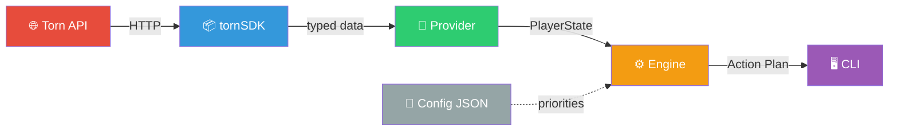
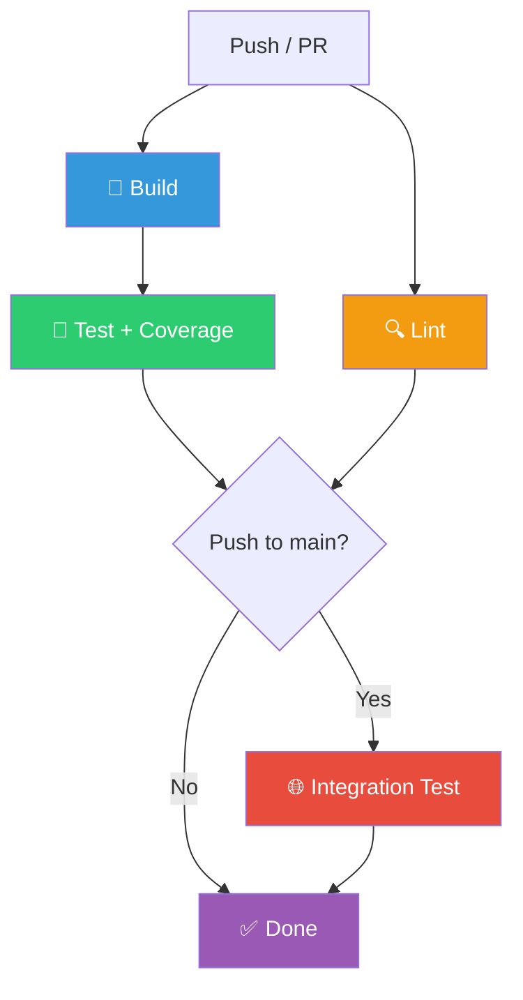

<div align="center">

# 🎯 Torn Advisor Engine

[](https://github.com/subhanjanOps/torn-advisor/actions/workflows/ci.yml)
[](https://go.dev)
[](LICENSE)
[](coverage.out)

**A rule-based decision engine for [Torn City](https://www.torn.com/) that analyzes your player state and recommends the optimal next actions — so you never waste energy, nerve, or cooldowns.**

[Getting Started](#-getting-started) · [Rules](#-rules) · [Configuration](#-configuration) · [Contributing](#-contributing)

</div>

---

## 📖 Overview

Torn Advisor connects to the [Torn API](https://api.torn.com/) via [tornSDK](https://github.com/subhanjanOps/tornSDK), evaluates **9 gameplay rules** against your live player state, and outputs a **prioritized action plan** telling you exactly what to do next.

```
$ TORN_API_KEY=xxx go run ./cmd/advisor/

=== Torn Advisor — Action Plan ===

1. [hospital] Heal Up (priority 98)
   Life is below 50% — heal before taking any action.

2. [drug] Take Xanax (priority 90)
   Xanax cooldown is ready — take Xanax for an energy boost.

3. [gym] Train at Gym (priority 80)
   Energy and happiness are sufficient — train your stats.
```

---

## 🏗️ Architecture



| Layer | Package | Responsibility |
|:------|:--------|:---------------|
| **Domain** | `domain/` | Core types (`PlayerState`, `Action`, `Rule` interface) — zero dependencies |
| **Engine** | `engine/` | Evaluates rules, builds sorted action plan |
| **Rules** | `rules/` | 9 individual rule implementations with configurable priorities |
| **Provider** | `providers/torn/` | Adapts tornSDK to the `StateProvider` interface |
| **Config** | `config/` | Loads rule priorities from JSON (with sensible defaults) |
| **CLI** | `cmd/advisor/` | Wires everything together, reads env vars, prints output |

### Design Principles

- **Clean Architecture** — dependency arrows point inward; `domain` has zero imports
- **Interface-driven** — `Rule` and `StateProvider` are interfaces, enabling easy testing and extension
- **Configurable** — rule priorities can be overridden via a JSON config file without changing code

---

## 📂 Project Structure

```
torn-advisor/
├── .github/workflows/
│   └── ci.yml                 # GitHub Actions: test, lint, integration
├── cmd/advisor/
│   ├── main.go                # CLI entry point
│   └── main_test.go           # CLI tests
├── config/
│   ├── config.go              # Priority loading from JSON
│   └── config_test.go         # Config tests
├── domain/
│   ├── models.go              # PlayerState, Action, Rule, StateProvider
│   └── priority.go            # Named priority constants
├── engine/
│   ├── engine.go              # Engine runner
│   ├── engine_test.go         # Engine tests
│   ├── planner.go             # Sort + filter actions
│   ├── planner_test.go        # Planner tests
│   └── rule_interface.go      # Type aliases for domain interfaces
├── providers/torn/
│   ├── provider.go            # tornSDK → PlayerState adapter
│   └── provider_test.go       # Provider tests (mocked API)
├── rules/
│   ├── hospital.go            # 🏥 Heal Up rule
│   ├── chain.go               # ⛓️ Continue Chain rule
│   ├── war.go                 # ⚔️ Save Energy for War rule
│   ├── xanax.go               # 💊 Take Xanax rule
│   ├── rehab.go               # 🩺 Rehab rule
│   ├── gym.go                 # 🏋️ Train at Gym rule
│   ├── crime.go               # 🔫 Do Crimes rule
│   ├── travel.go              # ✈️ Fly Abroad rule
│   ├── booster.go             # ⚡ Use Booster rule
│   ├── defaults.go            # Default rule set factory
│   └── rules_test.go          # Rule tests
├── tests/
│   └── integration_test.go    # End-to-end test (real API)
├── config.example.json        # Example priorities config
├── Makefile                   # Build, test, lint, cover targets
├── go.mod
└── LICENSE                    # MIT
```

---

## 🚀 Getting Started

### Prerequisites

| Tool | Version | Purpose |
|:-----|:--------|:--------|
| [Go](https://go.dev/dl/) | 1.25+ | Language runtime |
| [tornSDK](https://github.com/subhanjanOps/tornSDK) | v0.1.0 | Torn API data access |
| [golangci-lint](https://golangci-lint.run/) | latest | Linting (optional) |

### Installation

```bash
git clone https://github.com/subhanjanOps/torn-advisor.git
cd torn-advisor
go mod download
```

> **Note:** The project uses a local `replace` directive for `tornSDK`. Ensure the `tornSDK` repo is cloned at `../tornSDK` relative to this project.

### Run

```bash
# Required: set your Torn API key
export TORN_API_KEY="your-api-key-here"

# Optional: load custom priorities
export ADVISOR_CONFIG="./config.example.json"

# Run the advisor
go run ./cmd/advisor/
```

### Build

```bash
make build          # → bin/advisor
make run            # build + run
```

---

## 📋 Rules

The engine ships with **9 built-in rules**. Each rule evaluates a specific game condition and returns a prioritized action recommendation (or nothing if the condition isn't met).

| # | Rule | Emoji | Condition | Default Priority | Category |
|:-:|:-----|:-----:|:----------|:----------------:|:---------|
| 1 | **Hospital** | 🏥 | Life < 50% of max | `98` | `hospital` |
| 2 | **Chain** | ⛓️ | Faction chain is active | `97` | `chain` |
| 3 | **War** | ⚔️ | Faction war is active | `95` | `war` |
| 4 | **Xanax** | 💊 | Drug cooldown = 0 | `90` | `drug` |
| 5 | **Rehab** | 🩺 | Addiction > 50 | `85` | `rehab` |
| 6 | **Gym** | 🏋️ | Energy > 0 AND Happy > 4000 | `80` | `gym` |
| 7 | **Crime** | 🔫 | Nerve = Max AND Max > 0 | `70` | `crime` |
| 8 | **Travel** | ✈️ | Travel cooldown = 0 | `60` | `travel` |
| 9 | **Booster** | ⚡ | Booster cooldown = 0 | `55` | `booster` |

> **Priority order:** Higher numbers execute first. The engine evaluates all rules, then sorts the resulting actions by priority descending.

### Priority Levels Reference

| Constant | Value | Use Case |
|:---------|:-----:|:---------|
| `PriorityUrgent` | 100 | Life-threatening situations |
| `PriorityVeryImportant` | 90 | Time-sensitive opportunities |
| `PriorityImportant` | 70 | Valuable but not urgent |
| `PriorityNormal` | 50 | Routine actions |
| `PriorityLow` | 30 | Nice-to-have |

---

## ⚙️ Configuration

Rule priorities can be customized without modifying code by providing a JSON config file:

```bash
export ADVISOR_CONFIG="./my-priorities.json"
```

**Example `config.example.json`:**

```json
{
  "hospital": 98,
  "chain": 97,
  "war": 95,
  "xanax": 90,
  "rehab": 85,
  "gym": 80,
  "crime": 70,
  "travel": 60,
  "booster": 55
}
```

- Only include the rules you want to override — omitted rules keep their defaults
- Set a rule to `0` to effectively disable it
- Swap priorities to change the recommended order (e.g., make gym higher priority than xanax)

---

## 🧩 Adding Custom Rules

Implement the `Rule` interface from the `domain` package:

```go
package myrules

import "github.com/subhanjanOps/torn-advisor/domain"

type FarmingRule struct {
    Priority int
}

func (r FarmingRule) Evaluate(state domain.PlayerState) *domain.Action {
    if state.Energy > 50 {
        return &domain.Action{
            Name:        "Farm NPCs",
            Description: "Energy is sufficient — farm NPCs for cash.",
            Priority:    r.Priority,
            Category:    "farming",
        }
    }
    return nil
}
```

Register it alongside the default rules:

```go
cfg := config.DefaultPriorities()
ruleSet := rules.DefaultRulesWithConfig(cfg)
ruleSet = append(ruleSet, myrules.FarmingRule{Priority: 65})
eng := engine.NewEngine(ruleSet)
```

---

## 🧪 Testing

```bash
make test            # Run all unit tests
make test-verbose    # Run with verbose output
make cover           # Run with coverage report
make cover-html      # Generate HTML coverage report
make lint            # Run golangci-lint
```

### Test Coverage

| Package | Coverage |
|:--------|:--------:|
| `rules/` | 100% |
| `engine/` | 100% |
| `config/` | 100% |
| `providers/torn/` | 100% |
| `cmd/advisor/` | 100% (excl. `main()`) |
| **Overall** | **~90.5%** |

### Integration Tests

Integration tests hit the real Torn API and are gated behind a build tag:

```bash
export TORN_API_KEY="your-api-key"
go test ./... -tags=integration -run TestIntegration -count=1
```

---

## 🔄 CI/CD

GitHub Actions runs automatically on every push and PR to `main`:



| Job | Trigger | What it does |
|:----|:--------|:-------------|
| **test** | Push & PR | Build, run tests with `-race`, generate coverage |
| **lint** | Push & PR | Run `golangci-lint` |
| **integration** | Push to `main` only | Full pipeline test against live Torn API (requires `TORN_API_KEY` secret) |

---

## 🗺️ Roadmap

- [ ] Discord bot integration
- [ ] AI layer for adaptive recommendations
- [ ] Web dashboard with real-time updates
- [ ] Multi-account support
- [ ] Battle target selection rule
- [ ] OC (Organized Crime) timing rule
- [ ] Company work/train rule

---

## 📄 License

This project is licensed under the **MIT License** — see the [LICENSE](LICENSE) file for details.

---

<div align="center">

**Built for the streets of Torn City** 🏙️

[Torn City](https://www.torn.com/) · [tornSDK](https://github.com/subhanjanOps/tornSDK) · [Report Bug](https://github.com/subhanjanOps/torn-advisor/issues)

</div>